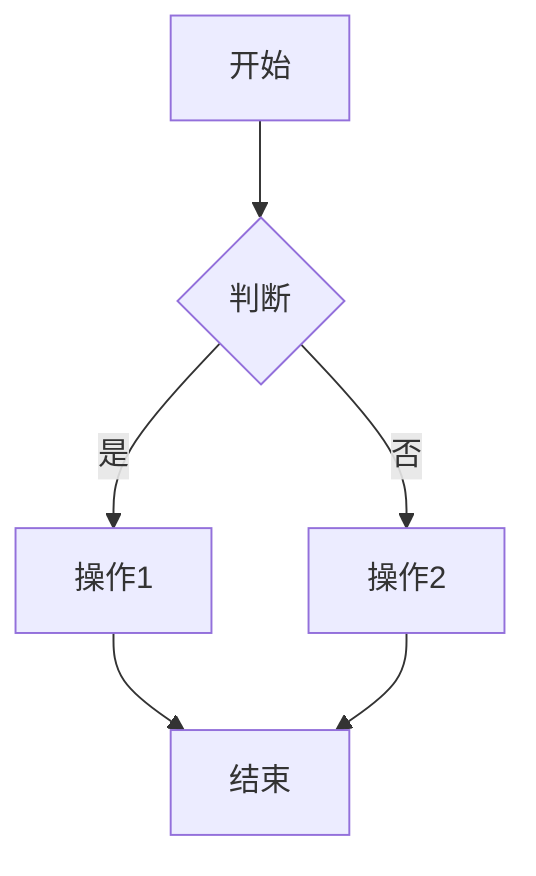

# Beeclaw 文档风格指南

> 确保文档一致性、可读性和可维护性

---

## 📝 写作原则

### 1. 用户优先

- ✅ 从用户角度组织内容
- ✅ 使用"你可以..."而非"系统支持..."
- ✅ 提供真实场景和案例
- ❌ 避免技术术语堆砌

**示例**:
```markdown
❌ 系统实现了基于文件系统的记忆存储机制
✅ 你可以将工作记录、学习笔记保存在记忆系统中
```

### 2. 简洁明了

- ✅ 一段话一个主题
- ✅ 列表优于段落
- ✅ 代码示例优于文字描述
- ❌ 避免冗长前言

**示例**:
```markdown
❌ 在开始之前，我想先说明一下这个功能的重要性...

✅ ## 功能说明
[直接进入主题]
```

### 3. 示例驱动

- ✅ 每个概念配一个代码示例
- ✅ 提供完整的可运行代码
- ✅ 标注预期输出
- ❌ 避免伪代码

**示例**:
```markdown
✅ **示例**:
```json
{
  "query": "投资",
  "scope": "all"
}
```

**预期输出**:
```
找到 3 个匹配...
```
```

### 4. 渐进式

- ✅ 从简单到复杂
- ✅ 每步都有验证
- ✅ 提供检查点
- ❌ 避免一次性展示所有内容

**示例**:
```markdown
✅
### 步骤 1: 基础配置（5分钟）
### 步骤 2: 进阶配置（15分钟）
### 步骤 3: 高级优化（可选，30分钟）
```

---

## 📁 文件组织

### 命名规范

| 类型 | 规范 | 示例 | 说明 |
|------|------|------|------|
| **文件名** | 小写 + 连字符 | `memory-system.md` ✅ | 避免 `Memory-System.md` ❌ |
| **目录名** | 小写 | `cookbook/` ✅ | 避免 `Cookbook/` ❌ |
| **技能文件** | 大写 + 连字符 | `WEEKLY-REPORT.md` ✅ | 技能文件特例 |

### 目录结构

```
docs/
├── README.md              # 文档索引
├── getting-started.md     # 快速开始
├── configuration.md       # 配置指南
│
├── guide/                 # 用户指南
│   ├── memory-system.md
│   └── skill-system.md
│
├── design/                # 设计文档
│   ├── context-management.md
│   └── resilience.md
│
├── references/            # 参考文档
│   ├── cli.md
│   └── tools.md
│
├── cookbook/              # 实战案例
│   ├── README.md
│   ├── basic/
│   └── advanced/
│
├── troubleshooting/       # 故障排查
│   ├── README.md
│   └── startup-issues.md
│
└── operations/            # 运维文档
    ├── deployment.md
    └── performance.md
```

---

## 📄 文档模板

### 标准文档模板

```markdown
# 文档标题

> 一句话描述文档目的（可选）

## 目录（>50行文档）

- [章节 1](#章节-1)
- [章节 2](#章节-2)

---

## 章节 1

### 子章节

**内容**...

**示例**:
```language
代码示例...
```

**输出**:
```
预期输出...
```

---

## 相关文档

- [相关文档 1](./link1.md)
- [相关文档 2](./link2.md)
```

### 案例文档模板

```markdown
# 案例标题

> 一句话描述案例目标

## 场景

[真实场景描述]

## 目标

- ✅ 目标 1
- ✅ 目标 2

## 前置条件

- [ ] 条件 1
- [ ] 条件 2

## 步骤

### 步骤 1: XXX

[详细步骤...]

**示例**:
```bash
命令示例...
```

**验证**:
```bash
验证命令...
```

### 步骤 2: XXX
[...]

## 完整代码

[可复制的完整示例]

## 验证

- [ ] 功能验证
- [ ] 边界测试

## 常见问题

### Q1: 问题 1
**A**: 解决方案 1

## 进阶拓展

[优化建议和扩展功能]

## 下一步

- [相关案例](./link.md)
```

---

## 🎨 格式规范

### 标题层级

| 层级 | 用途 | 示例 |
|------|------|------|
| **H1** | 文档标题（仅 1 个） | `# 记忆系统设计` |
| **H2** | 主要章节 | `## 核心概念` |
| **H3** | 子章节 | `### 索引机制` |
| **H4** | 详细说明（慎用） | `#### 算法细节` |

**原则**: 超过 4 层考虑拆分文档

---

### 列表使用

#### 无序列表

用于并列项，无顺序要求：

```markdown
- 特性 1
- 特性 2
- 特性 3
```

#### 有序列表

用于步骤、流程：

```markdown
1. 第一步
2. 第二步
3. 第三步
```

#### 任务列表

用于前置条件和验证：

```markdown
- [x] 已完成
- [ ] 待完成
```

---

### 表格使用

用于对比、参数说明：

```markdown
| 参数 | 类型 | 必需 | 默认值 | 说明 |
|------|------|------|--------|------|
| query | string | ✅ | - | 搜索关键词 |
| scope | string | - | "all" | 搜索范围 |
```

**原则**: ≥3 列使用表格，否则用列表

---

### 代码块

**总是标注语言**:

```markdown
✅
```typescript
const result = await tool();
```

❌
```
const result = await tool();
```
```

**代码长度**:
- ✅ 控制在 20 行以内
- ✅ 超过则用文件链接
- ✅ 包含必要注释

**示例**:
```markdown
> 完整代码见 [示例文件](../examples/demo.ts)

```typescript
// 核心逻辑
const result = await tool({ query: "demo" });
console.log(result);
```
```

---

### 链接

#### 相对路径（文档内）

```markdown
✅ [配置指南](./configuration.md)
✅ [记忆系统](./guide/memory-system.md)
```

#### 绝对路径（外部链接）

```markdown
✅ [Bun 官网](https://bun.sh)
```

#### 首次提及链接

```markdown
✅ 记忆系统（详见 [记忆系统设计](./guide/memory-system.md)）支持...

❌ [记忆系统](./guide/memory-system.md)支持...
```

---

### 强调

| 语法 | 用途 | 示例 |
|------|------|------|
| `**粗体**` | 重要概念 | **核心特性** |
| `*斜体*` | 术语、强调 | *渐进式* |
| `` `代码` `` | 代码、命令 | `memory_search` |
| `~~删除线~~` | 废弃内容 | ~~旧版本~~ |

---

### Emoji 使用

**适度使用**，用于章节标记：

```markdown
✅
## 🚀 快速开始
## 📖 文档
## 🔧 开发
## 🤝 贡献

❌
## 🚀🚀🚀 超级快速开始
```

**常用 Emoji**:
- 🚀 快速开始
- 📖 文档
- 🔧 开发/配置
- ✨ 新功能
- 🐛 Bug 修复
- ⚠️ 警告
- 💡 提示
- 🎯 目标
- ✅ 完成

---

## 🖼️ 视觉元素

### 流程图（Mermaid）

用于复杂逻辑：

```markdown

```

### 架构图

使用 ASCII 或 Mermaid：

```markdown
```
┌──────────┐
│  Client  │
└────┬─────┘
     │
┌────▼─────┐
│  Server  │
└──────────┘
```
```

---

## ✍️ 语气与措辞

### 推荐用词

| 场景 | ✅ 推荐 | ❌ 避免 |
|------|---------|---------|
| **指导** | 你可以... | 系统支持... |
| **建议** | 建议... | 必须... |
| **命令** | 执行以下命令 | 你应该执行... |
| **说明** | 这个功能... | 本系统实现了... |

### 示例对比

```markdown
❌ 本系统实现了基于文件系统的记忆存储机制，支持用户进行...

✅ 你可以将工作记录保存在记忆系统中。系统会自动：
- 分类存储（facts/knowledge）
- 建立索引
- 定期压缩
```

---

## 📏 长度规范

### 文档长度

| 类型 | 建议长度 | 说明 |
|------|---------|------|
| **快速开始** | < 200 行 | 5 分钟阅读 |
| **指南文档** | 200-500 行 | 15-30 分钟 |
| **参考文档** | 无限制 | 按需组织 |
| **案例文档** | 100-300 行 | 单一场景 |

### 段落长度

- ✅ 每段 3-5 句
- ✅ 超过 5 句考虑分拆
- ✅ 使用列表替代长段落

### 代码长度

- ✅ 示例代码 < 20 行
- ✅ 完整代码 < 50 行
- ✅ 超过则用文件链接

---

## 🔍 质量检查清单

发布前检查：

### 基础检查
- [ ] 文件名符合规范
- [ ] 标题清晰且唯一（H1）
- [ ] 顶部有简介段落
- [ ] 包含目录（>50 行文档）

### 内容质量
- [ ] 代码示例可运行
- [ ] 配置示例完整
- [ ] 步骤可独立验证
- [ ] 无错别字和语法错误

### 结构化
- [ ] 有明确的目标/适用场景
- [ ] 逻辑分层清晰
- [ ] 有"下一步"或"相关文档"

### 可维护性
- [ ] 无硬编码路径/URL
- [ ] 版本敏感信息已标注
- [ ] 归档旧版本（如有）

### 用户体验
- [ ] 新手能理解（避免术语堆砌）
- [ ] 提供故障排除提示
- [ ] 有视觉辅助（图表/截图）

---

## 🌐 多语言支持

### 术语表

建立统一术语翻译：

| 中文 | 英文 | 说明 |
|------|------|------|
| 子代理 | Subagent | 独立执行的 AI Agent 实例 |
| 记忆系统 | Memory System | 文件系统 + 索引的知识存储 |
| 技能 | Skill | 可复用的提示词模块 |
| 主动系统 | Proactive System | 定时任务和主动通知 |

### 代码注释

**统一使用英文**:

```typescript
// ✅ Good
// Create a new skill instance
const skill = await createSkill('weekly-report');

// ❌ Bad
// 创建一个新的技能实例
const skill = await createSkill('weekly-report');
```

---

## 📚 参考资料

### 优秀文档案例

- [GitHub Docs](https://docs.github.com/)
- [Vercel Docs](https://vercel.com/docs)
- [Stripe Docs](https://stripe.com/docs)

### 文档系统理论

- [Divio 文档系统](https://documentation.divio.com/)
- [Write the Docs 指南](https://www.writethedocs.org/guide/)

---

## 🤝 贡献指南

如果你想改进文档：

1. **Fork 仓库**
2. **创建分支**: `git checkout -b docs/your-improvement`
3. **遵循本指南**: 确保符合风格规范
4. **本地预览**: 使用 Markdown 预览工具
5. **提交 PR**: 描述改进内容

---

**维护者**: Beeclaw Team
**最后更新**: 2026-03-14
**版本**: v1.0.0
