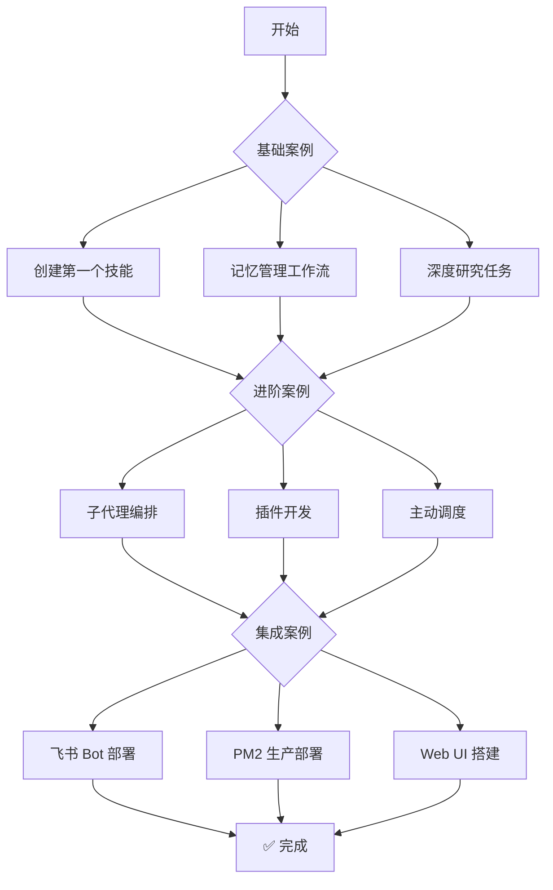

# Beeclaw 实战案例库

> 通过对话让 Beeclaw 帮你完成真实任务

## 📚 案例分类

### 🌱 基础案例（Basic）

适合新手，快速上手核心功能。

| 案例 | 难度 | 时间 | 学习重点 |
|------|------|------|---------|
| [创建第一个技能](./basic/first-skill.md) | ⭐ | 5分钟 | 通过对话创建技能 |
| [记忆管理工作流](./basic/memory-workflow.md) | ⭐ | 10分钟 | 通过对话管理记忆 |
| [深度研究任务](./basic/research-task.md) | ⭐⭐ | 15分钟 | 让 Beeclaw 帮你研究主题 |

### 🚀 进阶案例（Advanced）

适合有经验用户，掌握高级特性。

| 案例 | 难度 | 时间 | 学习重点 |
|------|------|------|---------|
| [子代理编排](./advanced/subagent-orchestration.md) | ⭐⭐⭐ | 20分钟 | 让 Beeclaw 并行处理任务 |
| [插件开发全流程](./advanced/plugin-development.md) | ⭐⭐⭐ | 30分钟 | 开发 Beeclaw 扩展（开发者） |
| [主动调度系统](./advanced/proactive-scheduling.md) | ⭐⭐ | 15分钟 | 让 Beeclaw 定时执行任务 |

### 🔗 集成案例（Integration）

多系统集成和实战部署。

| 案例 | 难度 | 时间 | 学习重点 |
|------|------|------|---------|
| [飞书 Bot 部署全流程](./integration/feishu-bot-deploy.md) | ⭐⭐ | 30分钟 | 在飞书中使用 Beeclaw |

---

## 🎯 如何选择案例

### 场景 1：我是新手，想快速上手

推荐路径：
```
创建第一个技能 → 记忆管理工作流 → 深度研究任务
```

**预期成果**：30分钟内掌握核心功能

### 场景 2：我想自动化日常任务

推荐路径：
```
记忆管理工作流 → 主动调度系统 → 创建技能
```

**预期成果**：学会让 Beeclaw 自动工作

### 场景 3：我要在团队中使用

推荐路径：
```
飞书 Bot 部署 → 子代理编排 → 主动调度系统
```

**预期成果**：完整的生产级使用

### 场景 4：我是开发者

推荐路径：
```
理解基础功能 → 插件开发 → 子代理编排
```

**预期成果**：掌握扩展开发能力

---

## 📝 案例结构说明

每个案例包含以下部分：

### 1. 场景描述
- 真实使用场景
- 你想解决的问题

### 2. 目标
- 通过对话让 Beeclaw 完成什么

### 3. 对话步骤
- 示例对话
- Beeclaw 的响应
- 预期结果

### 4. 验证
- 如何验证成功

### 5. 常见问题
- 疑难解答

---

## 🛠️ 案例开发规范

如果你想贡献新的案例，请遵循以下规范：

### 文件命名
- 使用小写 + 连字符：`my-case-study.md` ✅
- 避免大写和下划线：`My-Case-Study.md` ❌

### 文档结构
```markdown
# 案例标题

> 一句话描述案例目标

## 场景
[真实场景描述]

## 目标
- 目标 1
- 目标 2

## 前置条件
- [ ] 条件 1
- [ ] 条件 2

## 步骤

### 步骤 1: XXX
[详细步骤...]

### 步骤 2: XXX
[详细步骤...]

## 完整代码
[可复制的完整示例]

## 验证
[如何验证成功]

## 常见问题
- Q: 问题 1
- A: 解决方案 1

## 下一步
- [相关案例链接]
```

### 代码示例规范
- 标注语言类型
- 控制在 30 行以内
- 包含必要注释
- 提供预期输出

---

## 🤝 贡献案例

我们欢迎社区贡献实战案例！

### 贡献流程
1. Fork 仓库
2. 在 `docs/cookbook/` 对应目录创建 `.md` 文件
3. 按照案例模板编写
4. 提交 Pull Request

### 案例评审标准
- ✅ 真实可用
- ✅ 步骤清晰
- ✅ 代码可运行
- ✅ 包含验证步骤
- ✅ 提供故障排查

---

## 📊 学习路径推荐



---

## 🔗 相关文档

- [学习路径](../learning-paths.md) - 系统化学习指南
- [工具参考](../references/tools.md) - 工具 API 文档
- [故障排查](../troubleshooting/) - 问题诊断
- [配置指南](../configuration.md) - 配置选项

---

**最后更新**: 2026-03-14
