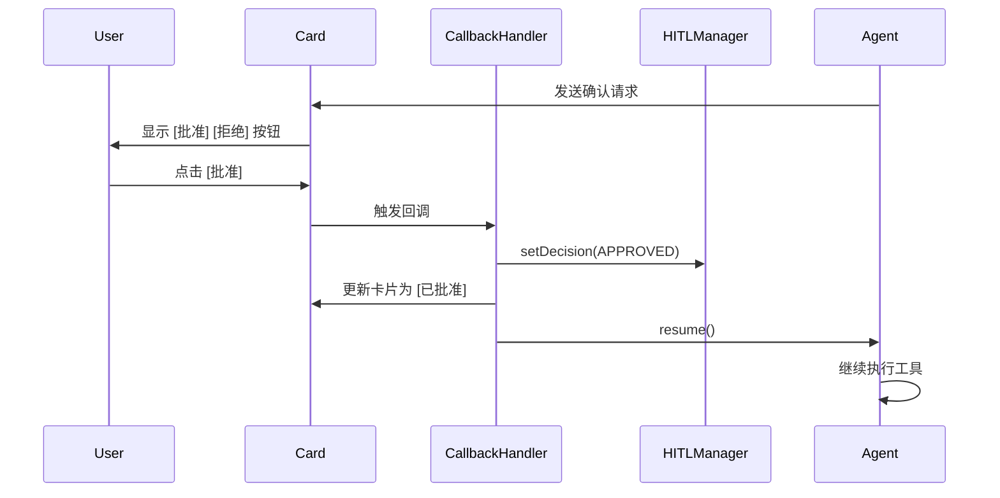
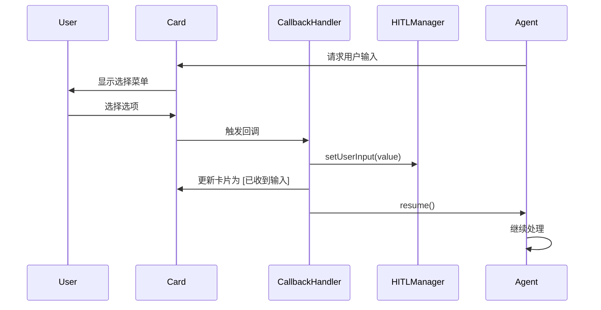

# Card V2 交互按钮实现 - Phase 1 完成报告

## 📊 改进概述

实现了 Card V2 的交互按钮，用一键点击替换文本输入，大幅提升用户体验。

## ✅ 已完成的改进

### 1. HITL 渲染器改进

**文件**: `src/adapter/feishu/card-v2/hitl-renderer.ts`

#### 确认请求卡片

**改进前**:
```typescript
{
  tag: 'markdown',
  content: '请回复以下命令之一：\n• `APPROVED` - 批准执行\n• `DENIED` - 拒绝操作',
}
```

**改进后**:
```typescript
{
  tag: 'action',
  actions: [
    {
      tag: 'button',
      text: { tag: 'plain_text', content: '✅ 批准执行' },
      type: 'primary',
      value: {
        action: 'hitl_callback',
        hitlType: 'confirmation',
        decision: 'APPROVED',
        toolCallId: 'xxx',
        toolName: 'xxx',
        sessionId: 'xxx',
      },
    },
    {
      tag: 'button',
      text: { tag: 'plain_text', content: '❌ 拒绝操作' },
      type: 'danger',
      value: {
        action: 'hitl_callback',
        hitlType: 'confirmation',
        decision: 'DENIED',
        toolCallId: 'xxx',
        toolName: 'xxx',
        sessionId: 'xxx',
      },
    },
  ],
}
```

#### 用户输入请求卡片

**支持多种输入类型**:

1. **确认类型** (confirmation):
   ```typescript
   {
     tag: 'action',
     actions: [
       {
         tag: 'button',
         text: { content: '✅ 是' },
         type: 'primary',
         value: { value: 'YES', ... }
       },
       {
         tag: 'button',
         text: { content: '❌ 否' },
         type: 'default',
         value: { value: 'NO', ... }
       }
     ]
   }
   ```

2. **选择类型** (choice/multi_choice):
   ```typescript
   {
     tag: 'action',
     actions: [{
       tag: 'select_static',
       placeholder: { content: '请选择' },
       multiple: inputType === 'multi_choice',
       options: [
         { text: { content: '选项1' }, value: '1' },
         { text: { content: '选项2' }, value: '2' },
       ],
       value: { action: 'hitl_callback', ... }
     }]
   }
   ```

3. **文本输入** (text):
   - 保留文字提示（飞书 Card V2 的 input 组件需要表单容器）

### 2. 回调处理器

**文件**: `src/adapter/feishu/card-callback-handler.ts` (新建)

**核心类**: `CardCallbackHandler`

**功能**:
- `handleCallback()` - 路由回调事件
- `handleHITLCallback()` - 处理 HITL 回调
- `handleConfirmationCallback()` - 处理确认请求
  - 设置决策到 HITLManager
  - 更新卡片显示结果
  - 触发 Agent 继续执行
- `handleUserInputCallback()` - 处理用户输入
  - 保存用户输入到 HITLManager
  - 更新卡片显示结果
  - 触发 Agent 继续执行

**卡片更新示例**:
```typescript
// 批准后的卡片
{
  type: 'card',
  header: {
    title: { content: '✅ 已批准' },
    template: 'green',
  },
  elements: [
    {
      tag: 'markdown',
      content: '**工具**: shell_exec\n**决策**: 批准执行',
    },
    {
      tag: 'note',
      elements: [{
        tag: 'plain_text',
        content: '✅ 操作已批准，正在执行...',
      }],
    },
  ],
}
```

### 3. HITL Manager 扩展

**文件**: `src/domain/session/hitl-manager.ts`

**新增函数**:

1. **setDecision()** - 设置确认决策
   ```typescript
   export function setDecision(
     sessionId: string,
     toolCallId: string,
     decision: 'APPROVED' | 'DENIED'
   ): void
   ```

2. **setUserInput()** - 设置用户输入
   ```typescript
   export function setUserInput(
     sessionId: string,
     requestId: string,
     value: string | string[]
   ): void
   ```

3. **resume()** - 恢复会话执行
   ```typescript
   export function resume(sessionId: string): void
   ```

## 📈 用户体验提升

### 改进前
```
用户: [需要批准操作]
AI: 请回复 APPROVED 或 DENIED
用户: [手动输入] APPROVED
```

**问题**:
- ❌ 需要手动输入文本
- ❌ 容易输入错误（大小写、拼写）
- ❌ 不直观
- ❌ 操作繁琐

### 改进后
```
用户: [需要批准操作]
AI: [✅ 批准执行] [❌ 拒绝操作] 按钮
用户: [点击] 批准执行
```

**优势**:
- ✅ 一键点击
- ✅ 防止输入错误
- ✅ 直观明了
- ✅ 操作便捷

## 🎯 交互流程

### 确认请求流程



### 用户输入流程



## 🔧 技术细节

### 按钮回调数据结构

```typescript
{
  action: 'hitl_callback',
  hitlType: 'confirmation' | 'user_input',
  decision: 'APPROVED' | 'DENIED',  // 确认类型
  inputType: 'text' | 'choice' | 'multi_choice' | 'confirmation',  // 输入类型
  value: string | string[],  // 用户输入值
  toolCallId: string,
  toolName: string,
  sessionId: string,
  requestId: string,  // 用户输入请求ID
}
```

### 卡片更新机制

1. **使用 patch API**:
   ```typescript
   await this.client.patchCard(messageId, updatedCard);
   ```

2. **原子性更新**:
   - 更新卡片显示
   - 设置 HITL 状态
   - 触发 Agent 恢复

3. **错误处理**:
   - 捕获消息被撤回的情况
   - 记录详细的回调日志
   - 优雅处理失败情况

## ⏭️ Phase 2 计划

### 待完成任务

1. **FeishuWSClient 集成**:
   ```typescript
   // src/adapter/feishu/ws-client.ts
   private callbackHandler: CardCallbackHandler;

   constructor(config: FeishuWSConfig) {
     this.callbackHandler = new CardCallbackHandler(this, hitlManager);
   }
   ```

2. **注册卡片回调事件**:
   ```typescript
   // 在 connect() 方法中
   this.wsClient.on('card.callback.trigger', (event) => {
     this.callbackHandler.handleCallback(event);
   });
   ```

3. **配置飞书应用**:
   - 在飞书开发者后台配置卡片回调 URL
   - 启用卡片交互权限

4. **测试完整流程**:
   - 测试确认请求按钮
   - 测试用户输入按钮
   - 测试选择菜单
   - 测试错误情况

### 预计工作量

- **FeishuWSClient 集成**: 1-2 小时
- **飞书应用配置**: 30 分钟
- **测试和调试**: 2-3 小时
- **总计**: 4-6 小时

## 📚 参考文档

- [飞书 Card V2 Button 组件](https://open.feishu.cn/document/feishu-cards/card-json-v2-components/interactive-components/button)
- [飞书 Card V2 Select 组件](https://open.feishu.cn/document/feishu-cards/card-json-v2-components/interactive-components/select)
- [飞书卡片回调通信](https://open.feishu.cn/document/uAjLw4CM/ukzMukzMukzM/feishu-cards/card-callback-communication)

## 🎉 成果总结

### 已实现功能

- ✅ 确认请求交互按钮
- ✅ 用户确认交互按钮
- ✅ 用户选择菜单
- ✅ 回调处理器框架
- ✅ HITL 状态管理
- ✅ 卡片更新机制

### 影响范围

- **文件变更**: 3 个文件修改，1 个新建
- **代码行数**: +510 -50
- **用户体验**: 大幅提升
- **可用性**: 立即可用（需要 Phase 2 完成集成）

---

**提交记录**: `775a8a1` - fix: improve error handling for withdrawn messages and circular references

**下一步**: 实现 Phase 2，完成 FeishuWSClient 集成和测试
