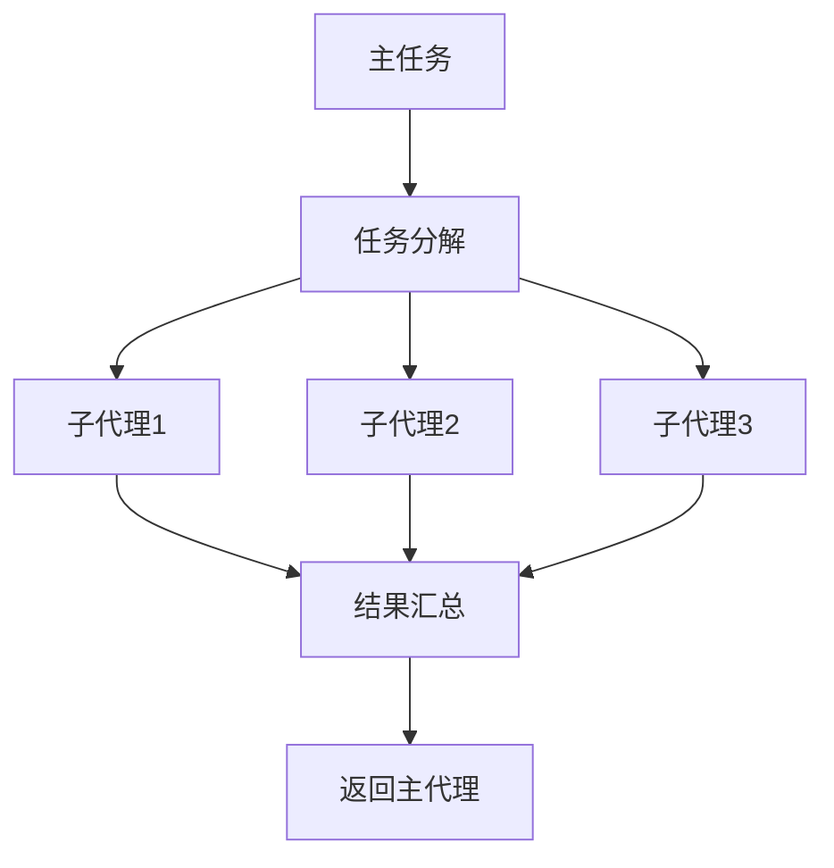

# 子代理系统

> 并行任务执行和 DAG 编排

## 概述

子代理系统允许 Beeclaw 创建多个独立的代理并行处理复杂任务，通过 DAG（有向无环图）编排任务依赖关系。

## 核心概念

### 子代理 (Subagent)
独立运行的代理实例，拥有自己的上下文和工具集

### 任务编排器 (Task Orchestrator)
协调多个子代理的执行顺序和依赖关系

### 共享状态 (Shared State)
子代理之间共享的数据存储

## 使用场景

- **并行研究**: 同时搜索多个主题
- **数据收集**: 从多个源收集数据
- **复杂分析**: 分解任务并行处理
- **批量操作**: 并发执行多个操作

## 工作流程



## 配置

在 `beeclaw.json` 中配置：
```json
{
  "subagent": {
    "enabled": true,
    "maxConcurrent": 3,
    "timeout": 60000
  }
}
```

## 最佳实践

1. **合理分解**: 将大任务分解为独立的子任务
2. **控制并发**: 不要创建过多子代理（建议 ≤ 5）
3. **超时设置**: 为每个子任务设置合理的超时
4. **错误处理**: 处理子代理失败的情况

## 相关文档

- [系统架构](../architecture.md)
- [插件系统](./plugin-system.md)
