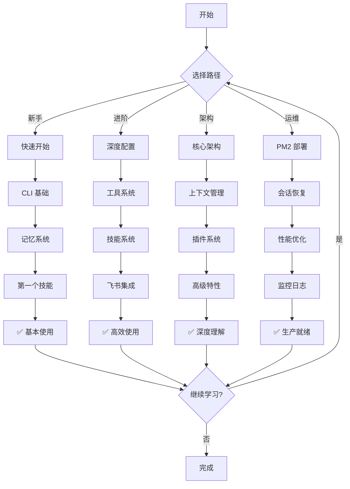

# 学习路径

> 根据你的角色和目标，选择最适合的学习路径。

## 目录

- [🌱 新手入门（0-1天）](#-新手入门0-1天)
- [🚀 进阶用户（1-7天）](#-进阶用户1-7天)
- [🏗️ 架构理解（7天+）](#️-架构理解7天)
- [🛡️ 生产部署](#️-生产部署)
- [🤝 贡献者路径](#-贡献者路径)

---

## 🌱 新手入门（0-1天）

**目标**：快速上手，理解基本概念，完成第一次对话

### 第 1 步：安装和配置（15分钟）

1. **[快速开始](./getting-started.md)**
   - 安装 Bun 和依赖
   - 配置 API Key
   - 启动 CLI

**检查点**：
- ✅ 成功启动 CLI
- ✅ 能与 AI 进行基本对话

### 第 2 步：CLI 基本使用（30分钟）

2. **[CLI 参考 - 基本命令](./references/cli.md#基本命令)**
   - 学习 `/help`、`/model`、`/quit` 等命令
   - 尝试多行输入
   - 理解会话持久化

**练习**：
```bash
# 练习 1: 切换模型
> /model list
> /model switch zhipu glm-4

# 练习 2: 查看帮助
> /help
```

**检查点**：
- ✅ 能使用基本斜杠命令
- ✅ 理解如何切换模型

### 第 3 步：理解记忆系统（1小时）

3. **[记忆系统 - 工作流示例](./guide/memory-system.md#工作流示例)**
   - 理解 facts vs knowledge 的区别
   - 尝试 `memory_record` 记录事实
   - 使用 `memory_search` 搜索记忆

**练习**：
```bash
# 练习 1: 记录你的偏好
> /memory record user 我喜欢简洁的代码风格

# 练习 2: 搜索记忆
> /memory search 偏好
```

**检查点**：
- ✅ 理解记忆系统的分层设计
- ✅ 能主动记录和搜索信息

### 第 4 步：第一个实战任务（30分钟）

4. **[实战：创建第一个技能](./cookbook/basic/first-skill.md)**
   - 创建一个简单的技能
   - 测试技能执行
   - 理解技能的作用

**预期成果**：
- ✅ 成功创建并执行第一个技能
- ✅ 理解技能系统的价值

---

## 🚀 进阶用户（1-7天）

**目标**：掌握核心功能，配置个性化环境，提升使用效率

### 第 1 步：深度配置（2小时）

1. **[配置指南](./configuration.md)**
   - 理解环境变量 vs 配置文件
   - 配置多个 Provider
   - 自定义 Agent 行为

2. **[用户配置](./configuration.md#用户配置)**
   - 设置时区和位置
   - 配置个性化提示词

**练习**：
```json
// 练习: 配置多 Provider
{
  "providers": [
    {"name": "zhipu", "default": true},
    {"name": "openai"}
  ],
  "user": {
    "location": "北京",
    "timezone": "Asia/Shanghai"
  }
}
```

**检查点**：
- ✅ 成功配置多个 Provider
- ✅ 理解配置热加载机制

### 第 2 步：工具系统（3小时）

3. **[工具参考](./references/tools.md)**
   - 学习网络工具（web_search, web_fetch）
   - 掌握文件工具（file_read, file_write）
   - 理解 Shell 工具的安全机制

4. **[深度研究工具](./references/tools.md#深度研究工具)**
   - 使用 `deep_research` 进行系统化研究
   - 理解不同深度级别的差异

**练习**：
```bash
# 练习 1: 深度研究并保存报告
> 帮我研究"2024年电动汽车市场趋势"，并保存到 reports/

# 练习 2: 使用文件工具
> 读取 reports/ev-market-2024.md 并总结要点
```

**检查点**：
- ✅ 能熟练使用 10+ 个工具
- ✅ 理解工具的安全限制

### 第 3 步：技能系统（3小时）

5. **[技能系统](./guide/skill-system.md)**
   - 理解技能的 YAML frontmatter
   - 创建和更新技能
   - 技能的成熟度分级

6. **[实战：技能创建进阶](./cookbook/basic/skill-creation.md)**
   - 创建带参数的技能
   - 技能的测试和调试

**练习**：
```bash
# 练习: 创建"周报生成"技能
> 创建一个技能，每周五自动生成本周工作总结
```

**检查点**：
- ✅ 成功创建 3+ 个个性化技能
- ✅ 理解技能的进化机制

### 第 4 步：飞书集成（2小时，可选）

7. **[飞书集成](./guide/feishu-integration.md)**
   - 创建飞书应用
   - 配置 WebSocket 连接
   - 理解 Card V2 消息

8. **[飞书消息优化](./design/feishu-message-optimization.md)**
   - 流式消息体验
   - 折叠面板设计

**检查点**：
- ✅ 成功部署飞书 Bot
- ✅ 能在飞书中使用所有功能

---

## 🏗️ 架构理解（7天+）

**目标**：深入理解系统设计，参与贡献或二次开发

### 第 1 步：核心架构（4小时）

1. **[系统架构](./architecture.md)**
   - 子代理系统设计
   - 会话管理架构
   - 共享状态机制

2. **[统一会话架构](./design/unified-session.md)**
   - CLI/Bot 统一会话管理
   - 会话持久化机制

**检查点**：
- ✅ 能画出系统架构图
- ✅ 理解子代理的调度逻辑

### 第 2 步：上下文管理（3小时）

3. **[上下文管理](./design/context-management.md)**
   - Token 预算分配
   - Prompt 分层优先级
   - 智能压缩策略

**练习**：
```bash
# 练习: 分析上下文使用
> 分析当前对话的 token 使用情况
```

**检查点**：
- ✅ 理解 Token 估算算法
- ✅ 能优化上下文使用

### 第 3 步：插件系统（4小时）

4. **[插件系统](./guide/plugin-system.md)**
   - OpenClaw 兼容层
   - Hook 机制
   - 插件开发流程

5. **[实战：插件开发](./cookbook/advanced/plugin-development.md)**
   - 开发自定义插件
   - 注册 Hook 点位
   - 插件测试

**检查点**：
- ✅ 成功开发一个插件
- ✅ 理解 Hook 的执行时机

### 第 4 步：高级特性（6小时）

6. **[子代理系统](./guide/subagent-system.md)**
   - 并行任务执行
   - DAG 任务编排
   - 共享状态通信

7. **[弹性设计](./design/resilience.md)**
   - 熔断器模式
   - 统一重试机制
   - 降级策略

8. **[主动系统](./guide/proactive-system.md)**
   - 定时任务调度
   - 主动聊天
   - 通知推送

**检查点**：
- ✅ 能设计复杂的多子代理任务
- ✅ 理解系统的容错机制

---

## 🛡️ 生产部署

**目标**：将 Beeclaw 部署到生产环境，确保高可用

### 第 1 步：PM2 部署（2小时）

1. **[PM2 部署](./operations/deployment.md)**
   - PM2 配置详解
   - 进程守护
   - 日志管理

**检查点**：
- ✅ 成功使用 PM2 启动
- ✅ 配置自动重启

### 第 2 步：会话恢复（1小时）

2. **[会话恢复](./guide/session-recovery.md)**
   - 理解恢复机制
   - 配置恢复延迟
   - 处理未完成对话

**检查点**：
- ✅ 验证重启后会话恢复
- ✅ 理解恢复的边界条件

### 第 3 步：性能优化（3小时）

3. **[性能优化](./operations/performance.md)**
   - 响应延迟分析
   - Token 使用优化
   - 并发处理调优

**检查点**：
- ✅ 响应延迟 < 3 秒
- ✅ Token 使用率优化 20%+

### 第 4 步：监控和日志（2小时）

4. **[日志指南](./operations/logging.md)**
   - 日志级别配置
   - 结构化日志
   - 问题排查技巧

**检查点**：
- ✅ 配置合适的日志级别
- ✅ 能快速定位问题

---

## 🤝 贡献者路径

**目标**：为 Beeclaw 项目贡献代码或文档

### 第 1 步：开发环境（1小时）

1. **[开发指南 (CLAUDE.md)](../CLAUDE.md)**
   - 理解项目结构
   - 配置开发环境
   - 运行测试

**检查点**：
- ✅ 所有测试通过
- ✅ Lint 无错误

### 第 2 步：代码规范（1小时）

2. **[代码规范](../CLAUDE.md#important-patterns)**
   - 静态导入 vs 动态导入
   - 工具实现模式
   - 测试约定

**检查点**：
- ✅ 代码符合规范
- ✅ 添加了必要的测试

### 第 3 步：提交贡献（1小时）

3. **[贡献指南](../CONTRIBUTING.md)**
   - Fork 和分支管理
   - Commit 消息格式
   - Pull Request 流程

**检查点**：
- ✅ PR 通过 CI 检查
- ✅ 文档已更新

---

## 📊 学习路径总览



---

## 🎯 推荐学习顺序

### 场景 1：个人用户（CLI 为主）

```
新手入门 → 进阶用户(跳过飞书) → 架构理解 → 生产部署
```

**预计时间**：2-3 周

### 场景 2：团队使用（飞书 Bot）

```
新手入门 → 进阶用户(重点飞书) → 生产部署
```

**预计时间**：1-2 周

### 场景 3：二次开发

```
新手入门 → 架构理解 → 贡献者路径
```

**预计时间**：3-4 周

---

## 📚 相关文档

- [快速开始](./getting-started.md) - 安装和配置
- [文档目录](./README.md) - 完整文档索引
- [实战案例库](./cookbook/) - 端到端案例
- [故障排查](./troubleshooting/) - 问题诊断
