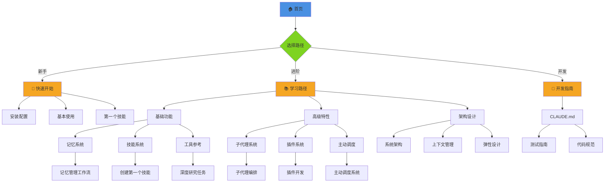
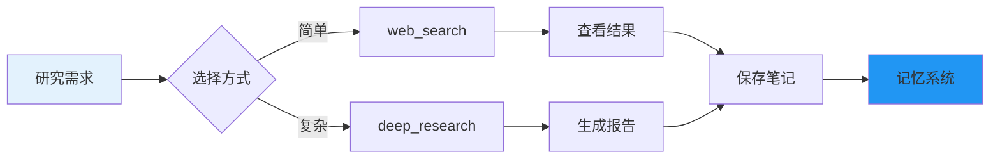
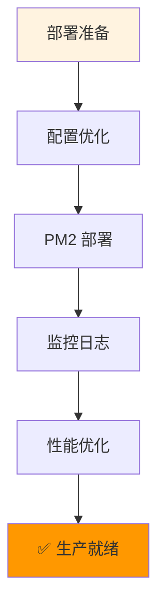
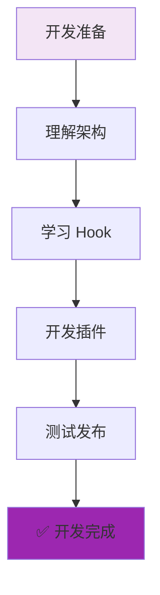
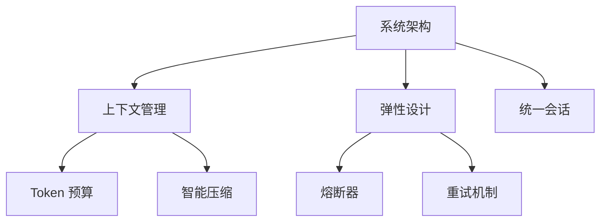
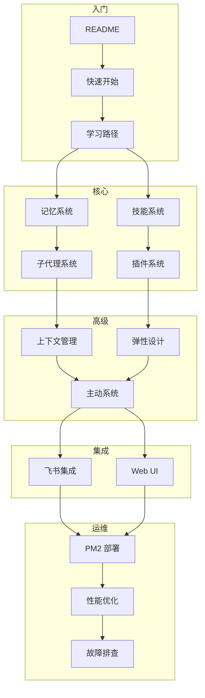

# Beeclaw 文档地图

> 可视化导航，快速找到你需要的文档

---

## 🗺️ 文档全景图

---

## 🎯 按场景导航

### 场景 1：我是新手，想快速上手

**预计时间**: 1 小时

**学习路径**:
1. [README](../README.md) - 了解项目（5分钟）
2. [快速开始](./getting-started.md) - 安装配置（15分钟）
3. [学习路径](./learning-paths.md) - 选择路径（5分钟）
4. [创建第一个技能](./cookbook/basic/first-skill.md) - 实战练习（15分钟）
5. [记忆管理工作流](./cookbook/basic/memory-workflow.md) - 深入理解（20分钟）

---

### 场景 2：我想深度研究某个主题

**推荐文档**:
1. [深度研究任务](./cookbook/basic/research-task.md) - 学习研究工具
2. [工具参考 - 网络工具](./references/tools.md#网络工具) - API 文档
3. [记忆管理工作流](./cookbook/basic/memory-workflow.md) - 保存研究结果

---

### 场景 3：我要部署到生产环境

**推荐文档**:
1. [配置指南](./configuration.md) - 生产配置
2. [PM2 部署](./operations/deployment.md) - 部署流程
3. [日志指南](./operations/logging.md) - 日志管理
4. [性能优化](./operations/performance.md) - 性能调优
5. [故障排查](./troubleshooting/) - 问题诊断

---

### 场景 4：我要开发插件或二次开发

**推荐文档**:
1. [开发指南 (CLAUDE.md)](../CLAUDE.md) - 开发规范
2. [系统架构](./architecture.md) - 架构设计
3. [插件系统](./guide/plugin-system.md) - 插件机制
4. [插件开发全流程](./cookbook/advanced/plugin-development.md) - 实战案例

---

## 📂 按文档类型导航

### 📖 入门文档（必读）

| 文档 | 用途 | 时间 |
|------|------|------|
| [README](../README.md) | 项目概览 | 5分钟 |
| [快速开始](./getting-started.md) | 安装配置 | 15分钟 |
| [学习路径](./learning-paths.md) | 学习指南 | 10分钟 |
| [配置指南](./configuration.md) | 详细配置 | 20分钟 |

---

### 📚 用户指南（按功能）

#### 核心系统

| 文档 | 说明 |
|------|------|
| [记忆系统](./guide/memory-system.md) | 文件系统 + 索引的知识存储 |
| [技能系统](./guide/skill-system.md) | 可复用的提示词模块 |
| [子代理系统](./guide/subagent-system.md) | 并行任务执行和 DAG 编排 |
| [插件系统](./guide/plugin-system.md) | OpenClaw 兼容插件 |

#### 高级功能

| 文档 | 说明 |
|------|------|
| [主动系统](./guide/proactive-system.md) | 定时任务、主动通知 |
| [会话恢复](./guide/session-recovery.md) | 重启后恢复对话 |
| [错误处理](./guide/error-handling.md) | 错误分类和重试 |
| [通知系统](./guide/notification.md) | CLI 和飞书通知 |

#### 集成

| 文档 | 说明 |
|------|------|
| [飞书集成](./guide/feishu-integration.md) | Bot 配置和 Card V2 |
| [Web UI](./guide/web-ui.md) | Web 界面使用 |

---

### 🏗️ 架构设计（深入理解）

| 文档 | 说明 |
|------|------|
| [系统架构](./architecture.md) | 核心架构设计 |
| [上下文管理](./design/context-management.md) | Token 预算和压缩 |
| [统一会话](./design/unified-session.md) | CLI/Bot 统一管理 |
| [弹性设计](./design/resilience.md) | 熔断、重试、降级 |

---

### 📚 参考文档（查阅）

| 文档 | 内容 |
|------|------|
| [CLI 参考](./references/cli.md) | 所有命令和斜杠命令 |
| [工具参考](./references/tools.md) | 40+ 工具的完整 API |

---

### 🎯 实战案例（动手练习）

#### 基础案例

| 案例 | 难度 | 时间 | 学习重点 |
|------|------|------|---------|
| [创建第一个技能](./cookbook/basic/first-skill.md) | ⭐ | 15分钟 | 技能系统 |
| [记忆管理工作流](./cookbook/basic/memory-workflow.md) | ⭐ | 20分钟 | 记忆系统 |
| [深度研究任务](./cookbook/basic/research-task.md) | ⭐⭐ | 25分钟 | 网络工具 |

#### 进阶案例

| 案例 | 难度 | 时间 | 学习重点 |
|------|------|------|---------|
| [子代理编排](./cookbook/advanced/subagent-orchestration.md) | ⭐⭐⭐ | 40分钟 | 并行执行 |
| [插件开发](./cookbook/advanced/plugin-development.md) | ⭐⭐⭐ | 60分钟 | Hook 机制 |
| [主动调度](./cookbook/advanced/proactive-scheduling.md) | ⭐⭐ | 30分钟 | 定时任务 |

#### 集成案例

| 案例 | 难度 | 时间 | 学习重点 |
|------|------|------|---------|
| [飞书 Bot 部署](./cookbook/integration/feishu-bot-deploy.md) | ⭐⭐ | 45分钟 | Bot 集成 |

---

### 🔧 运维文档（生产部署）

| 文档 | 说明 |
|------|------|
| [PM2 部署](./operations/deployment.md) | 生产环境部署 |
| [性能优化](./operations/performance.md) | 响应延迟优化 |
| [日志指南](./operations/logging.md) | 日志配置和排查 |
| [超时配置](./operations/timeout-config.md) | 智能超时设置 |

---

### 🔍 故障排查（问题诊断）

| 文档 | 说明 |
|------|------|
| [故障排查手册](./troubleshooting/) | 系统化诊断流程 |
| [启动问题](./troubleshooting/startup-issues.md) | API Key、依赖、端口 |
| [记忆系统问题](./troubleshooting/memory-issues.md) | 索引、搜索、权限 |
| [飞书集成问题](./troubleshooting/feishu-issues.md) | 连接、消息、权限 |
| [性能问题](./troubleshooting/performance-issues.md) | 延迟、内存、Token |

---

## 🔗 快速跳转

### 我想了解...

- **如何安装？** → [快速开始](./getting-started.md)
- **如何配置？** → [配置指南](./configuration.md)
- **有什么功能？** → [学习路径](./learning-paths.md)
- **工具怎么用？** → [工具参考](./references/tools.md)
- **如何开发插件？** → [插件开发](./cookbook/advanced/plugin-development.md)
- **如何部署？** → [PM2 部署](./operations/deployment.md)
- **遇到问题？** → [故障排查](./troubleshooting/)

### 我想查看...

- **API 文档** → [工具参考](./references/tools.md)
- **CLI 命令** → [CLI 参考](./references/cli.md)
- **架构设计** → [系统架构](./architecture.md)
- **实战案例** → [Cookbook](./cookbook/)
- **变更历史** → [CHANGELOG](./CHANGELOG.md)
- **写作规范** → [STYLE_GUIDE](./STYLE_GUIDE.md)

---

## 📊 文档统计

| 类型 | 数量 | 总行数 |
|------|------|--------|
| **入门文档** | 4 | ~800 |
| **用户指南** | 11 | ~2500 |
| **架构设计** | 7 | ~1500 |
| **参考文档** | 2 | ~1500 |
| **实战案例** | 6 | ~1800 |
| **运维文档** | 4 | ~800 |
| **故障排查** | 5 | ~600 |
| **总计** | **39** | **~9500** |

---

## 🎨 文档关系图

---

## 💡 使用建议

### 新手用户

1. **第一周**: 完成入门文档 + 2 个基础案例
2. **第二周**: 学习核心系统 + 1 个进阶案例
3. **第三周**: 尝试集成和部署

### 开发者

1. **Day 1**: 阅读 CLAUDE.md + 架构文档
2. **Day 2**: 学习插件系统
3. **Day 3**: 开发第一个插件

### 运维工程师

1. **准备阶段**: 阅读部署和配置文档
2. **部署阶段**: 按照部署指南操作
3. **运维阶段**: 监控日志 + 故障排查

---

**最后更新**: 2026-03-14
**版本**: v1.0.0
