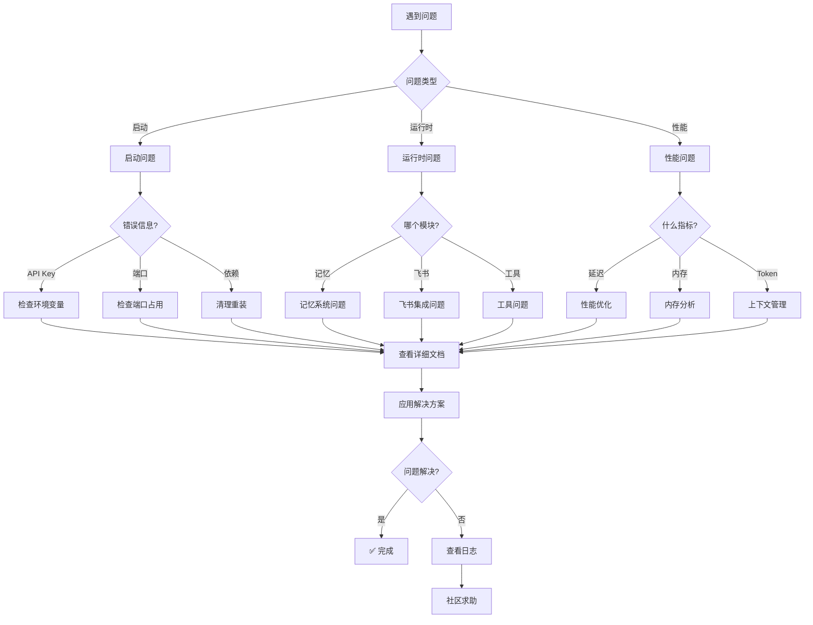

# 故障排查手册

> 系统化的问题诊断和解决方案

## 📚 问题分类

### 🚀 启动问题

| 问题 | 症状 | 文档 |
|------|------|------|
| API Key 无效 | `Error: Invalid API key` | [查看详情](./startup-issues.md#api-key-无效) |
| 依赖安装失败 | `Failed to install dependencies` | [查看详情](./startup-issues.md#依赖安装失败) |
| 端口被占用 | `Port 3000 is already in use` | [查看详情](./startup-issues.md#端口被占用) |
| 配置文件错误 | `Config validation failed` | [查看详情](./startup-issues.md#配置文件错误) |

### 🧠 记忆系统问题

| 问题 | 症状 | 文档 |
|------|------|------|
| 索引不存在 | `INDEX_NOT_FOUND` | [查看详情](./memory-issues.md#索引不存在) |
| 搜索无结果 | 搜索返回空 | [查看详情](./memory-issues.md#搜索无结果) |
| 文件权限错误 | `Permission denied` | [查看详情](./memory-issues.md#文件权限错误) |
| 压缩失败 | `Compression failed` | [查看详情](./memory-issues.md#压缩失败) |

### 📱 飞书集成问题

| 问题 | 症状 | 文档 |
|------|------|------|
| WebSocket 连接失败 | `Connection timeout` | [查看详情](./feishu-issues.md#websocket-连接失败) |
| 消息发送失败 | `Failed to send message` | [查看详情](./feishu-issues.md#消息发送失败) |
| Card V2 渲染错误 | 卡片显示异常 | [查看详情](./feishu-issues.md#card-v2-渲染错误) |
| 权限不足 | `Permission denied` | [查看详情](./feishu-issues.md#权限不足) |

### ⚡ 性能问题

| 问题 | 症状 | 文档 |
|------|------|------|
| 响应延迟高 | >5秒响应 | [查看详情](./performance-issues.md#响应延迟高) |
| 内存占用高 | >500MB | [查看详情](./performance-issues.md#内存占用高) |
| Token 使用过多 | 快速消耗配额 | [查看详情](./performance-issues.md#token-使用过多) |
| 并发处理慢 | 任务排队 | [查看详情](./performance-issues.md#并发处理慢) |

### 🔧 工具问题

| 问题 | 症状 | 文档 |
|------|------|------|
| Shell 命令被阻止 | `Command blocked` | [查看详情](./tool-issues.md#shell-命令被阻止) |
| 文件访问拒绝 | `Access denied` | [查看详情](./tool-issues.md#文件访问拒绝) |
| 网络请求失败 | `Network timeout` | [查看详情](./tool-issues.md#网络请求失败) |

---

## 🎯 快速诊断流程



---

## 🛠️ 通用排查步骤

### 1. 检查日志

```bash
# 查看最新日志
tail -f logs/beeclaw.log

# 查看错误日志
grep "ERROR" logs/beeclaw.log | tail -20

# 查看特定模块日志
grep "memory" logs/beeclaw.log
```

### 2. 验证配置

```bash
# 检查配置文件语法
cat beeclaw.json | jq .

# 验证环境变量
env | grep -E "(ZHIPU|OPENAI|LARK)"

# 测试 API 连通性
curl -H "Authorization: Bearer $ZHIPU_API_KEY" https://open.bigmodel.cn/api/paas/v3/model-api
```

### 3. 清理缓存

```bash
# 清理依赖
rm -rf node_modules bun.lock
bun install

# 清理记忆索引
rm data/memory/index.json
/memory index

# 清理会话
rm -rf data/sessions/*
```

### 4. 重启服务

```bash
# PM2 重启
bun run pm2:restart

# 或直接重启
bun run cli  # CLI 模式
bun run bot  # Bot 模式
```

---

## 📊 错误代码参考

### A类：启动错误 (1xxx)

| 代码 | 说明 | 解决方案 |
|------|------|---------|
| `A1001` | API Key 缺失 | 设置环境变量 |
| `A1002` | API Key 无效 | 重新生成 Key |
| `A1003` | 配置文件不存在 | 复制示例配置 |
| `A1004` | 配置验证失败 | 检查 JSON 语法 |
| `A1005` | 端口被占用 | 更换端口或停止占用进程 |

### B类：运行时错误 (2xxx)

| 代码 | 说明 | 解决方案 |
|------|------|---------|
| `B2001` | 网络请求超时 | 检查网络连接 |
| `B2002` | Token 预算耗尽 | 压缩上下文 |
| `B2003` | 工具执行失败 | 查看详细错误 |
| `B2004` | 记忆索引损坏 | 重建索引 |
| `B2005` | 文件权限不足 | 检查文件权限 |

### C类：集成错误 (3xxx)

| 代码 | 说明 | 解决方案 |
|------|------|---------|
| `C3001` | 飞书连接失败 | 检查凭证 |
| `C3002` | 飞书消息发送失败 | 检查权限 |
| `C3003` | MCP 服务启动失败 | 检查命令路径 |
| `C3004` | 插件加载失败 | 检查插件配置 |

---

## 🔍 日志级别说明

| 级别 | 说明 | 使用场景 |
|------|------|---------|
| `DEBUG` | 调试信息 | 开发调试 |
| `INFO` | 一般信息 | 正常运行 |
| `WARN` | 警告信息 | 潜在问题 |
| `ERROR` | 错误信息 | 需要关注 |
| `FATAL` | 致命错误 | 系统崩溃 |

**配置日志级别**:
```json
{
  "logging": {
    "level": "INFO",
    "file": "logs/beeclaw.log",
    "maxSize": "10MB",
    "rotation": "daily"
  }
}
```

---

## 💬 获取帮助

### 1. 搜索文档

```bash
# 搜索特定关键词
grep -r "关键词" docs/

# 查看工具文档
cat docs/references/tools.md
```

### 2. 社区支持

- **GitHub Issues**: [提交问题](https://github.com/xiaoxiath/beeclaw/issues)
- **讨论区**: [参与讨论](https://github.com/xiaoxiath/beeclaw/discussions)
- **文档**: [完整文档](../README.md)

### 3. 提交 Bug 报告

提供以下信息以加快诊断：

```markdown
**环境信息**:
- OS: [macOS/Windows/Linux]
- Bun 版本: [bun --version]
- Beeclaw 版本: [git log -1 --oneline]

**问题描述**:
[详细描述问题]

**复现步骤**:
1. [步骤1]
2. [步骤2]

**错误日志**:
```
[粘贴错误日志]
```

**配置文件** (脱敏):
```json
{
  "providers": [...],
  ...
}
```
```

---

## 📚 相关文档

- [日志指南](../operations/logging.md) - 日志配置和排查技巧
- [性能优化](../operations/performance.md) - 性能调优
- [配置指南](../configuration.md) - 配置选项

---

**最后更新**: 2026-03-14
